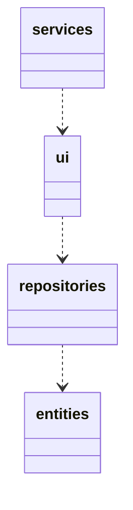
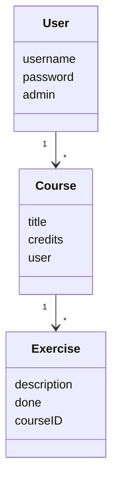
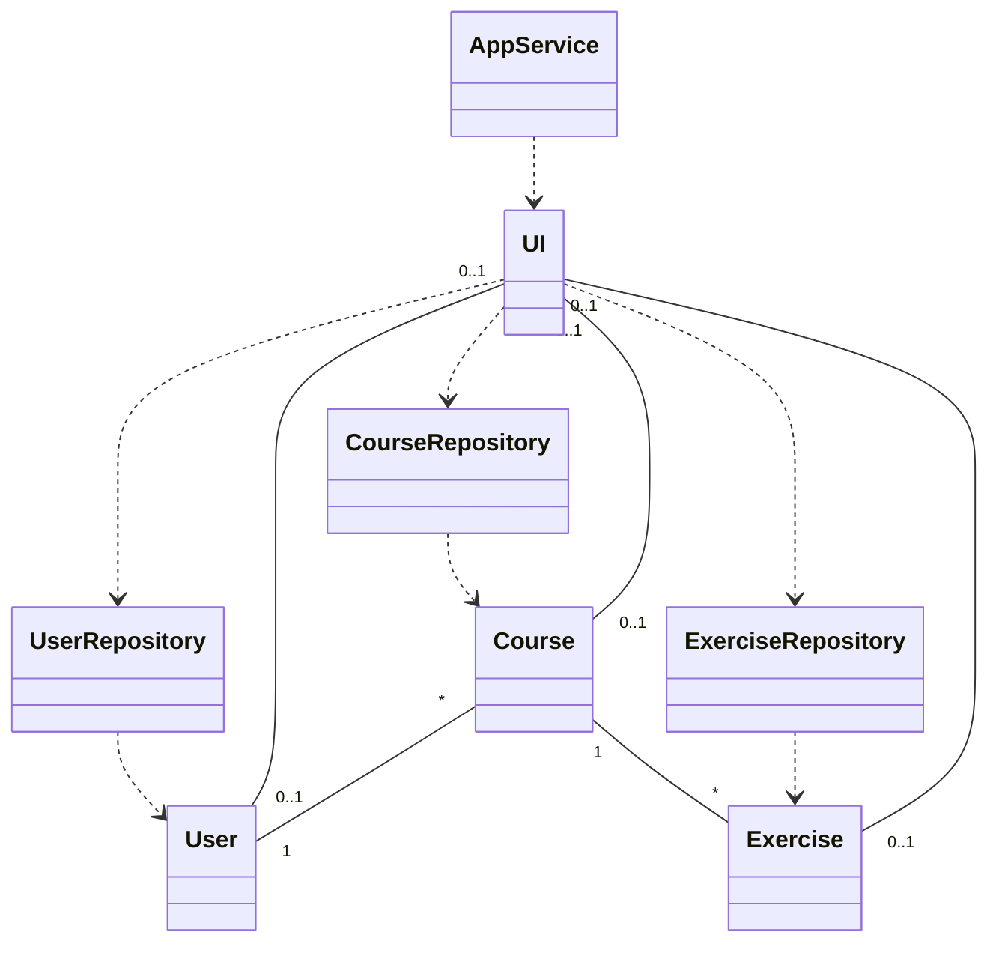
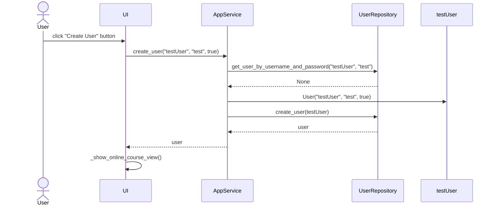
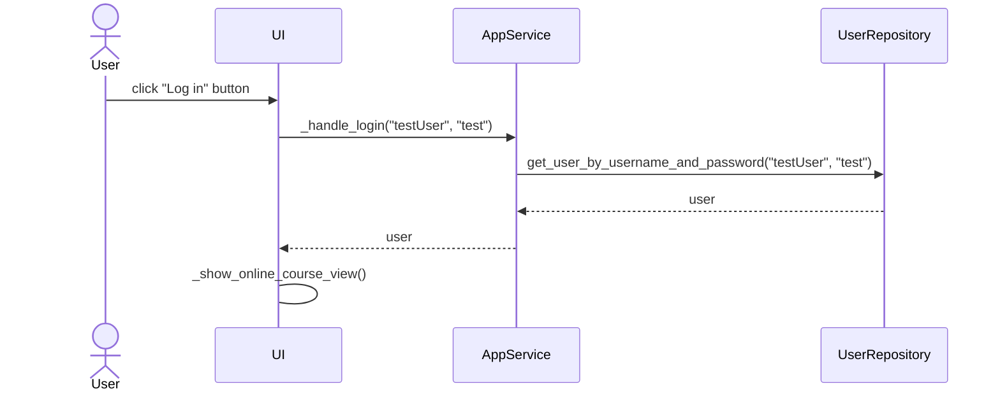

# Arkkitehtuurikuvaus

## Rakenne

Koodin pakkausrakenne on seuraava:

 Pakkaus **services**, joka sisältää käyttöliittymästä vastaavan pakkauksen ja koodin (**UI**). UI on  riippuvainen pakkauksesta  **repositories**, jonka avulla poimitaan näyttettäviä tietoja.  **repositories** sisältää  tallennuksesta vastaavaa koodia ja pakkaus **entities** sisältää luokkia, jotka kuvastavat sovelluksen oloita. 

## Käyttöliittymä

Käyttöliittymä sisältää seuraavat näkymät:
- Kirjautuminen (aloitussivu)
- käyttäjän rekisteröintisivu
- Kurssinäkymä
- Tehtävänäkymä

 UI luokka vastaa kaikista näkymistä. Vain yksi näkymä on näkyvillä ja jokainen on toteutettu omana luokkana.
 
## Sovelluslogiikka

Sovellus muodostuu seuraavista luokista:

- [User](https://github.com/paulikarels/ot-harjoitustyo/blob/main/verkkokurssi-app/src/entities/user.py)
- [Course](https://github.com/paulikarels/ot-harjoitustyo/blob/main/verkkokurssi-app/src/entities/course.py)
- [Exercise](https://github.com/paulikarels/ot-harjoitustyo/blob/main/verkkokurssi-app/src/entities/exercise.py)

Toiminallisuus alkaa User luokasta, joka voi luoda kursseja ja siihen tehtäviä.
Metodit käyttäjien ja kurssien luomiseen ovat esimerkiksi:
- `create_user(self, user)`
- `create_course(self, course, user_id)`

Toiminnallisuudesta vastaa luokka [AppService](https://github.com/paulikarels/ot-harjoitustyo/blob/main/verkkokurssi-app/src/services/app_service.py) , mikä viittaa UI luokkaan, joka hoitaa näkymät ja niiden poimittavat datat.

AppService pääsee seuraaviin luokkiin UI:n kautta; User, Course ja Exercise  [CourseRepository](https://github.com/paulikarels/ot-harjoitustyo/blob/main/verkkokurssi-app/src/repositories/course_repository.py), [UserRepository](https://github.com/paulikarels/ot-harjoitustyo/blob/main/verkkokurssi-app/src/repositories/user_repository.py) ja [ExerciseRepository](https://github.com/paulikarels/ot-harjoitustyo/blob/main/verkkokurssi-app/src/repositories/exercise_repository.py) kautta.

## Päätoiminnallisuudet

Sovelluksemme ja sen toimintalogiikka voidaan kuvata  sekvenssikaaviona.

### Käyttäjän luominen

Uuden käyttäjän luomista varten tarvitaan käyttäjätunnus (uniikki), salasana ja ylläpitäjätieto. Käyttäjän luonti eteenee "Create User" painikkea painaen.

Logiikkaamme alkaa painamisenjälkeen Appservicestä, jossa hoidamme käyttäjätunnuksen ja UserRepository:n avulla varmistemme sen olemassa olon.
Tämän jälkeen tallennamme uuden luodun Userin create_user metodilla. Käyttäjä luonnin jälkeen voidaan UI:n avulla jatkaa/kirjautua Kurssinäkymään.

### Sisäänkirjautuminen

Käyttäjä voi kirjautua luodun käyttäjän jälkeen tunkemalla käyttäjätunnuksen ja salasanan syötekenttiin ja klikkaamalla painiketta "Log in".

Yhtälailla kuin luomisessa, "Log in" painamisen jälkeen `AppService` etsii metodillaa onko käyttäjä olemassa sen käyttäjätunnuksella ja salasanalla
`UserRepository`:n avulla. Tämän jälkeen `UserRepository` selvittää ovatko tunnukset olemassa ja täsmäävätkö tunnukset tietokannassa olevien kanssa. Nyt näiden jälkeen käyttäjä pääsee Kurssinäkymään kirjautuneella käyttäjällä.
