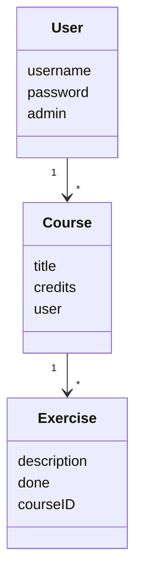
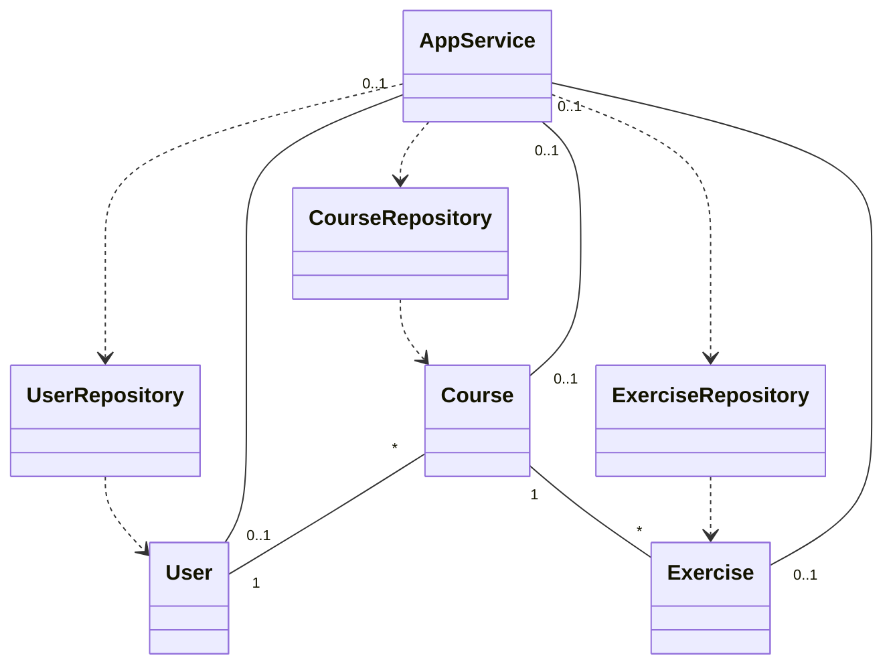

# Ohjelman arkkitehtuuri

## Sovelluslogiikka

Sovellus muodostuu seuraavista luokista:

- [User](https://github.com/paulikarels/ot-harjoitustyo/blob/main/verkkokurssi-app/src/entities/user.py)
- [Course](https://github.com/paulikarels/ot-harjoitustyo/blob/main/verkkokurssi-app/src/entities/course.py)
- [Exercise](https://github.com/paulikarels/ot-harjoitustyo/blob/main/verkkokurssi-app/src/entities/exercise.py)

Toiminallisuus alkaa User luokasta, joka voi luoda kursseja ja siihen tehtäviä.
Metodit käyttäjien ja kurssien luomiseen ovat esimerkiksi:
- `create_user(self, user)`
- `create_course(self, course, user_id)`

Toiminnallisuudesta vastaa luokka [AppService](https://github.com/paulikarels/ot-harjoitustyo/blob/main/verkkokurssi-app/src/services/app_service.py) (työn alla, tällä hetkellä UI luokka vastaa kyseistä).

AppService pääsee seuraaviin luokkiin; User, Course ja Exercise  [CourseRepository](https://github.com/paulikarels/ot-harjoitustyo/blob/main/verkkokurssi-app/src/repositories/course_repository.py), [UserRepository](https://github.com/paulikarels/ot-harjoitustyo/blob/main/verkkokurssi-app/src/repositories/user_repository.py) ja [ExerciseRepository](https://github.com/paulikarels/ot-harjoitustyo/blob/main/verkkokurssi-app/src/repositories/exercise_repository.py) kautta.

