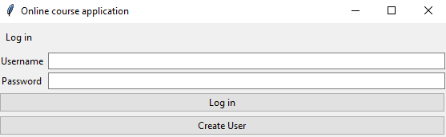
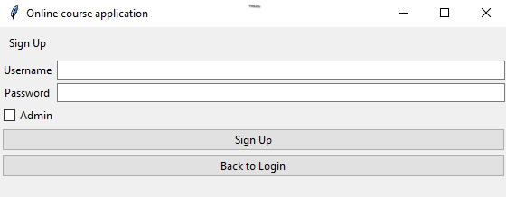
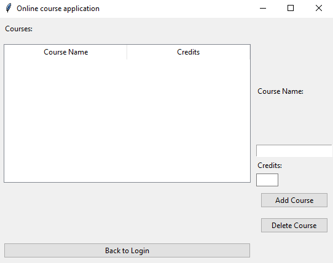
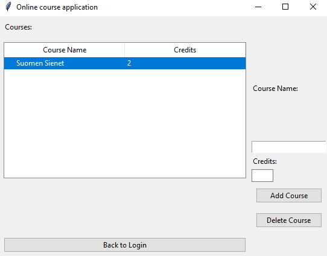
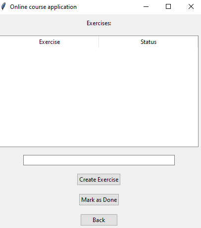
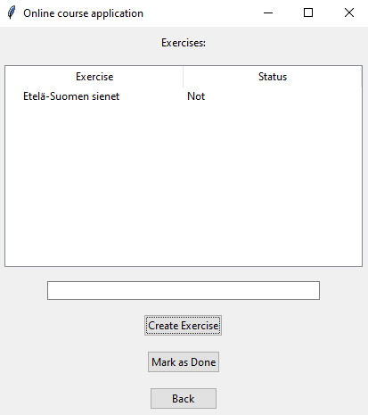
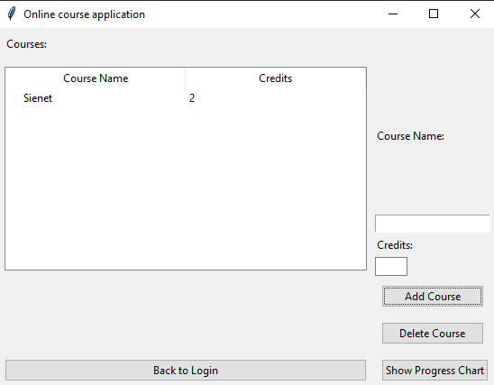

# Käyttöohje

Löydät viimeisimmän  [releasen](https://github.com/paulikarels/ot-harjoitustyo/releases) koodin Assets-otsikolta ladattavaksi. Voit myös ladata reposition tiedostopolkuun komennolla: `git clone https://github.com/paulikarels/ot-harjoitustyo`

## Sovelluksen käynnistys

Suorita seuraavat käskyt ennen sovelluksen käynnistämistä.

Asenna riippuvuudet komennolla:

`poetry install`

Alusta sovellus komennolla:

`poetry run invoke build`

Käynnistä sovellus komennolla:

`poetry run invoke start`

## Kirjautuminen ja rekisteröityminen

Sovelluksen käynnistysnäkymä on seuraava:

Rekisteröitynyt käyttäjä voi vain kirjautua sisään näkymässä syöttämällä olemassa olevat käyttäjätiedot (username & password) ja painamalla Log in. Luodakseen uuden käyttäjän pitää siirtyä rekisteröinti näkymään Create User painikkea painaen nähdääkseen rekisteröinti näkymän:

Uuden käyttäjän luodessa käyttäjä ja salana voi olla mikä tahansa, kunhan käyttäjänimi ei olemassa, josta sovellus ilmoittaa punaisella "user.unique" että käyttäjänimi on jo olemassa. Kun syötetyt käyttäjätiedot ovat syötetty (admin toiminnalisuus kesken, joten ei merkitystä onko päällä vai ei) ja Sign Up painiketta painettu käyttäjä on luotu. Nyt voit siirtyö "Back to Login" näppäimellä takaisin kirjautumisnäkymään. 

## Kurssien ja tehtävien luominen

Kirjautuessa sisään esiin tulee kurssinäkymä:

"Coursen Name" teksti kentän alla on kenttä johon syötetään kurssin nimi ja "Credits" alla kohdalle kurssin pisteet nollasta ylös. Kun kurssinimi ja sen pisteet on syötetty, paina "Add Course" lisääkseen kurssin.

Kurssi voidaan myös poistaa painamalla kurssia kerran ja painamalla "Delete Course" sen jälkeen.
Lisättyäsi kurssin, voit tupla-klikkaamalla kurssia siirtyä kurssin Tehtävä näkymään: 

Tehtävänäkymässä voit lisätä tehtäviä tehtäviä syöttämällä tekstikenttään tehtävän nimen ja painamalla "Create Exercise" sen jälkeen.

Luotu tehtävä listataan näkymään ja se voidaan merkata tehdyksi klikkaamalla sitä ja painamalla "Mark as Done"

## Graafinen kaavio tehdyille kursseille ja suoritetuille tehtäville

Voit katsoa päivämäärittäin tehtyjä kursseja ja niiden suoritettuja tehtäviä painamalla "Show Progress Chart"

 

Näet tämän jälkeen (esimerkki näkymä) kyseisen näkymän oletus selaimellassi, mistä näet luotujen kurssien aikataulut ja tehtävien suoritusajat.

 
