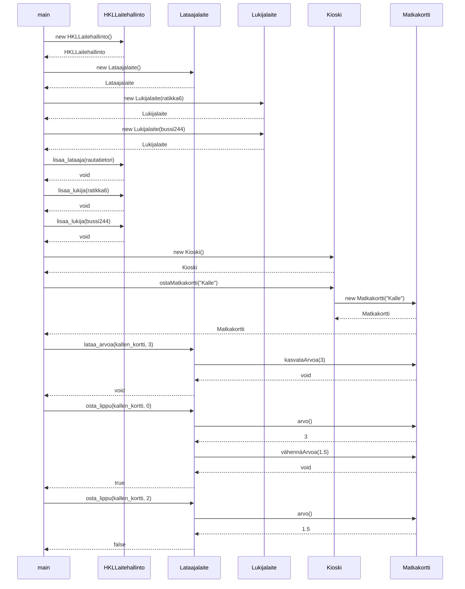

```mermaid
sequenceDiagram
    participant main
    
    main->>HKLLaitehallinto: new HKLLaitehallinto()
    HKLLaitehallinto-->>main:  HKLLaitehallinto
    main->>Lataajalaite: new Lataajalaite()
    Lataajalaite-->>main: Lataajalaite
    main->>Lukijalaite: new Lukijalaite(ratikka6)
    Lukijalaite-->>main: Lukijalaite
    main->>Lukijalaite: new Lukijalaite(bussi244)
    Lukijalaite-->>main: Lukijalaite

    main->>HKLLaitehallinto: lisaa_lataaja(rautatietori)
    HKLLaitehallinto-->>main: void
    main->>HKLLaitehallinto: lisaa_lukija(ratikka6)
    HKLLaitehallinto-->>main: void
    main->>HKLLaitehallinto: lisaa_lukija(bussi244)
    HKLLaitehallinto-->>main: void 

    main->>Kioski: new Kioski()
    Kioski-->>main: Kioski

    main->>Kioski: ostaMatkakortti("Kalle")
    Kioski->>Matkakortti: new Matkakortti("Kalle")
    Matkakortti-->>Kioski: Matkakortti
    Matkakortti-->>main: Matkakortti

    main->>Lataajalaite: lataa_arvoa(kallen_kortti, 3)
    Lataajalaite->>Matkakortti: kasvataArvoa(3)
    Matkakortti-->>Lataajalaite: void
    Lataajalaite-->>main: void

    main->>Lataajalaite: osta_lippu(kallen_kortti, 0)
    Lataajalaite->>Matkakortti: arvo()
    Matkakortti-->>Lataajalaite: 3
    Lataajalaite->>Matkakortti: vähennäArvoa(1.5)
    Matkakortti-->>Lataajalaite: void
    Lataajalaite-->>main: true

    main->>Lataajalaite: osta_lippu(kallen_kortti, 2)
    Lataajalaite->>Matkakortti: arvo()
    Matkakortti-->>Lataajalaite: 1.5
    Lataajalaite-->>main: false

```