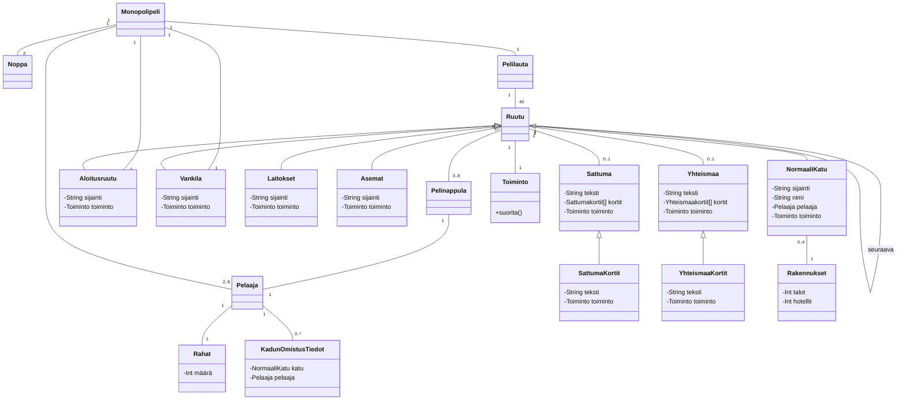

```mermaid
 classDiagram
    Monopolipeli "1" -- "2" Noppa
    Monopolipeli "1" -- "1" Pelilauta
    Pelilauta "1" -- "40" Ruutu
    Ruutu "1" -- "1" Ruutu : seuraava
    Ruutu "1" -- "0..8" Pelinappula
    Pelinappula "1" -- "1" Pelaaja
    
    Pelaaja "2..8" -- "1" Monopolipeli
    
    Monopolipeli "1" -- "1" Aloitusruutu
    Monopolipeli "1" -- "1" Vankila
    
    Ruutu <|-- Aloitusruutu
    Ruutu <|-- Vankila
    %%Ruutu <|-- SattumaJaYhteismaa
    Ruutu <|-- Laitokset
    Ruutu <|-- Asemat
    Ruutu <|-- NormaaliKatu 
    Ruutu "1" -- "1" Toiminto
    Ruutu "1" -- "0..1" Sattuma
    Ruutu "1" -- "0..1" Yhteismaa
    Sattuma <|-- SattumaKortit
    Yhteismaa <|-- YhteismaaKortit

    NormaaliKatu "0..4" -- "1" Rakennukset
    Pelaaja "1" -- "1" Rahat
    Pelaaja "1" -- "0..*" KadunOmistusTiedot


class Aloitusruutu {
    -String sijainti
    -Toiminto toiminto
}

class Vankila {
    -String sijainti
    -Toiminto toiminto
}


class Asemat {
    -String sijainti
    -Toiminto toiminto
}

class Laitokset {
    -String sijainti
    -Toiminto toiminto
}

class NormaaliKatu {
    -String sijainti
    -String nimi
    -Pelaaja pelaaja
    -Toiminto toiminto
}

class Sattuma {
    -String teksti
    -Sattumakortit[] kortit
    -Toiminto toiminto
}

class Yhteismaa {
    -String teksti
    -Yhteismaakortit[] kortit
    -Toiminto toiminto
}

class SattumaKortit {
    -String teksti
    -Toiminto toiminto
}

class YhteismaaKortit {
    -String teksti
    -Toiminto toiminto
}

class Rakennukset {
    -Int talot
    -Int hotellit
}

class Toiminto {
    +suorita()
}

class KadunOmistusTiedot {
    -NormaaliKatu katu
    -Pelaaja pelaaja
}

class Rahat {
    -Int määrä
}
```